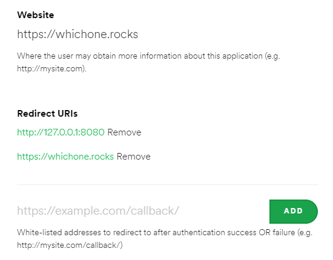
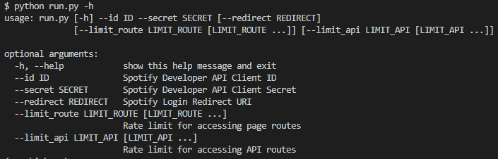

# whichone

https://whichone.rocks/

## Command Line Arguments

| Parameter     | Description                                          | Default                    | Required                 | Type   |
| ------------- | ---------------------------------------------------- | -------------------------- | ------------------------ | ------ |
| `id`          | Spotify Developer API Client                         | None                       | :heavy_check_mark:       | String |
| `secret`      | Spotify Developer API Client Secret                  | None                       | :heavy_check_mark:       | String |
| `redirect`    | Spotify Login Redirect URI                           | http://127.0.0.1:8080      | :heavy_multiplication_x: | String |
| `limit_route` | User IP address rate limit for accessing page routes | "50 per day" "30 per hour" | :heavy_multiplication_x: | List   |
| `limit_api`   | User IP address rate limit for accessing API routes  | "10 per day"               | :heavy_multiplication_x: | List   |

## Required Development Setup

- Setup a virtual environment and install the project dependencies:

```sh
python3 -m venv ve-whichone
source ve-whichone/Scripts/activate
pip install -r whichone/requirements.txt
```

- Create a new app on the [Spotify Developer Dashboard](https://developer.spotify.com/dashboard/)
- Whitelist the website address to the Spotify Developer app redirect URIs to redirect after Spotify authentication
  

- (Optional) Set the Spotify parameters as environment variables:

```sh
export SPOTIFY_CLIENT_ID='YOUR SPOTIFY CLIENT ID'
export SPOTIFY_CLIENT_SECRET='YOUR SPOTIFY CLIENT SECRET'
export SPOTIFY_REDIRECT_URI='YOUR SPOTIFY REDIRECT URI'
```

## Usage

```sh
# Get additional help regarding input parameters:
python run.py -h
# Run the server using only required parameters:
python run.py --id $SPOTIFY_CLIENT_ID --secret $SPOTIFY_CLIENT_SECRET
# Run the server using all optional parameters:
python run.py --id $SPOTIFY_CLIENT_ID --secret $SPOTIFY_CLIENT_SECRET \
    --redirect $SPOTIFY_REDIRECT_URI --limit_route "30 per hour" "50 per day" --limit_api "10 per day"
```




## Screenshots


## Contributors

| Name               | Github                                                        |
| ------------------ | ------------------------------------------------------------- |
| Alex McGill        | [mcgill-a](https://github.com/mcgill-a)                       |
| Alexander Thompson | [athompsonScottLogic](https://github.com/athompsonScottLogic) |
| Philip Hardy       | [PHardySL](https://github.com/PHardySL)                       |
