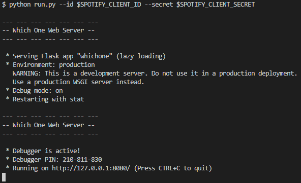

[](https://github.com/mcgill-a/whichone/actions/workflows/superlinter.yml)

# whichone

https://whichone.rocks/

## Required Development Setup

* Setup a virtual environment and install the project dependencies:
```sh
python3 -m venv ve-whichone
source ve-whichone/Scripts/activate
pip install -r whichone/requirements.txt 
```
* Create and setup a 'defaults.py' file in the config directory (example file included)
* Create a new app on the [Spotify Developer Dashboard](https://developer.spotify.com/dashboard/)
* Add the app 'Client ID' and 'Client Secret' tokens to defaults.py

## Usage
```sh
python run.py
```
* Go to http://localhost:8080/ to access the site




## Screenshots


## Contributors

| Name | Github |
|--|--|
| Alex McGill | [mcgill-a](https://github.com/mcgill-a)|
| Alexander Thompson |[athompsonScottLogic](https://github.com/athompsonScottLogic) |
| Philip Hardy | [PHardySL](https://github.com/PHardySL)|
